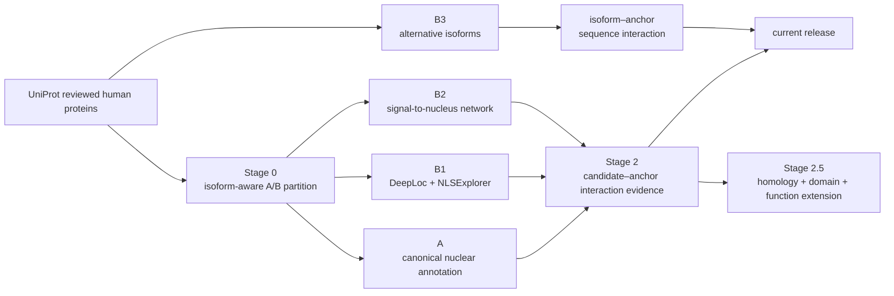

# ProteinDigger

ProteinDigger 是一个面向人类转录与表观遗传调控蛋白发现的分层候选挖掘流程。项目把 UniProt 核定位证据、序列模型、功能网络和蛋白互作证据组织为四条互补路线，并保留候选到调控蛋白（anchor）的逐对证据。

当前公开版本：`v2026.10.06`。

## 当前结果

| 路线 | 主要入口与筛选逻辑 | 候选记录 | candidate–anchor pairs |
|---|---|---:|---:|
| A | canonical 核定位注释 → 功能分层 → A3 focused → HI-union ∪ RF2-PPI final90 | 954 | 3,530 |
| B1 | DeepLoc `Nucleus > 0.5` 且 corrected NLSExplorer `> 0.5` → HI-union ∪ RF2-PPI final80 | 429 | 1,593 |
| B2 | 排除 B1 后的 signal-to-nucleus 功能网络 Top 2% → HI-union ∪ RF2-PPI final80 | 85 | 344 |
| B3 | alternative isoform 核定位与两阶段序列互作筛选 | 112 genes / 152 isoforms | 490 |
| **合计** | 四条正式路线 | **1,580** | **5,957** |

主表包含 1,573 个唯一 atomic genes 和 1,620 个 UniProt accessions。候选主表见 [`results/current_release/candidates_1580.tsv`](results/current_release/candidates_1580.tsv)，逐对互作证据见 [`results/current_release/candidate_anchor_pairs_5957.tsv`](results/current_release/candidate_anchor_pairs_5957.tsv)。

> 数据库或模型命中表示候选得到相应互作证据支持，不等同于新的直接结合实验验证。

## 流程概览



Stage 0 从 20,416 条 reviewed human canonical proteins 出发，按核定位注释是否适用于 canonical/displayed sequence 划分为 A（5,669）与 B（14,747），再按 2,368 个工作 anchors 的 accession 和 atomic gene 排除已知调控蛋白。Stage 1 负责候选生成；Stage 2 要求候选具有与调控 anchor 相联系的实验或预测互作证据。

详细定义、阈值和证据分辨率见 [`docs/methods/pipeline.md`](docs/methods/pipeline.md)。

## Stage 2.5 v3

Stage 2.5 已使用当前统一的 A1/B1/B2 输入重跑。它在 1,862 个 Stage 2 final80 阳性 seeds 与 2,631 个失败候选之间，联合序列同源性、domain architecture 和严格直接功能证据，得到 9 个扩展候选：

`H2BC11`、`H2BC4`、`H2BC12L`、`H2BC21`、`CDK11B`、`STK38L`、`MAP2K3`、`NRAS`、`MAP2K2`。

这些扩展候选不计入上面的 1,580 条正式路线记录和 5,957 条直接 PPI pairs。完整结果见 [`results/current_release/stage25/`](results/current_release/stage25/)，协议见 [`docs/methods/stage25_protocol.md`](docs/methods/stage25_protocol.md)。

## CAPSUL 官方划分评测

仓库同时提供 Nucleus Specialist 在 CAPSUL 官方 train/validation/test 划分上的回顾性评测。模型只用 validation BCE 选择学习率和 checkpoint，六个 checkpoint 冻结后才统一读取 test targets；所有分类指标使用固定阈值 `probability > 0.5`。

| Method | Nucleus F1 | Micro-F1 | Macro-F1 |
|---|---:|---:|---:|
| ESM-C 600M（论文） | 0.649 | 0.495 | 0.263 |
| middleclip1022（3 seeds, mean±SD） | 0.632±0.005 | 0.499±0.023 | 0.301±0.035 |
| fullwindow_mil（3 seeds, mean±SD） | 0.637±0.005 | 0.511±0.008 | 0.304±0.011 |

逐标签结果、paired bootstrap 和评测代码见 [`benchmarks/capsul/`](benchmarks/capsul/)。

## 仓库结构

```text
Protein_digger/
├── src/                         # 当前流程的构建、推理与验证代码
├── docs/methods/                # 方法、阈值与证据口径
├── results/current_release/     # 当前候选、互作对和 Stage 2.5 结果
├── benchmarks/capsul/           # CAPSUL 论文协议评测代码与指标
├── configs/current_release/     # 机器可读版本与计数
└── requirements.txt             # Python 依赖概览
```

大体积模型权重、embedding/cache、训练 checkpoint、原始数据库快照和运行日志不纳入 Git。分析脚本会对输入集合大小、唯一性、阈值、集合关系和 SHA256 做验证；复现时需按方法文档准备相应的 UniProt、GOA、Reactome、HI-union、RF2-PPI 及模型资源。

## 快速读取结果

```python
import pandas as pd

candidates = pd.read_csv(
    "results/current_release/candidates_1580.tsv", sep="\t"
)
pairs = pd.read_csv(
    "results/current_release/candidate_anchor_pairs_5957.tsv", sep="\t"
)

print(candidates.groupby("路线").size())
print(pairs.groupby("路线").size())
```

Python 分析代码以 Python 3.10+ 为目标。GPU 推理部分还需要对应模型仓库与权重，具体入口见 [`src/README.md`](src/README.md)。
