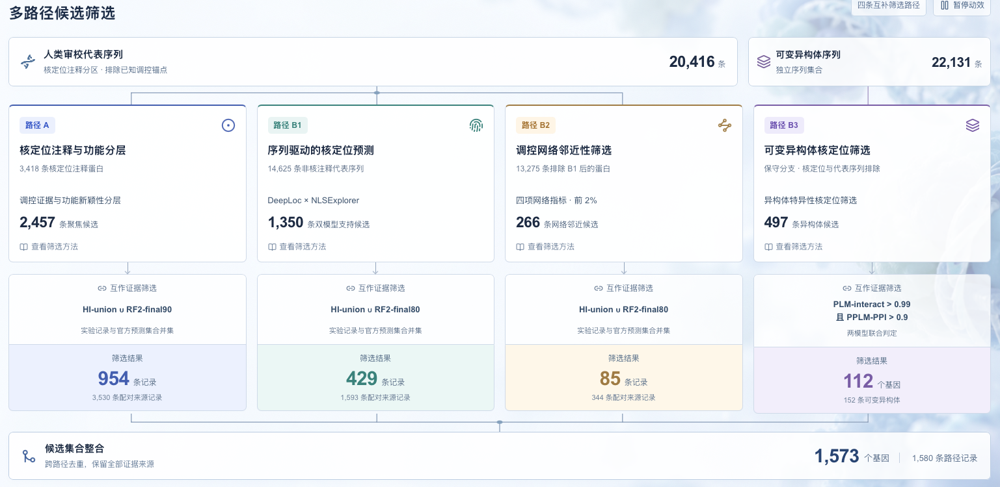

# ProteinDigger

**An evidence-traceable, multi-route workflow for discovering human proteins linked to transcriptional and epigenetic regulation.**

[中文](#中文) · [English](#english)



## 中文

ProteinDigger 是一个面向人类转录与表观遗传调控蛋白发现的多路径候选挖掘流程。它将人工审校的核定位注释、蛋白序列模型、调控网络邻近性和蛋白互作证据组织成四条互补路线，并保留每条候选记录从输入、筛选到调控蛋白（anchor）证据的完整来源。

当前公开版本：`v2026.10.06`。

### 核心思路

同一类调控蛋白不会只呈现一种可观测特征。ProteinDigger 因此从两类序列集合出发：20,416 条人类审校代表序列和 22,131 条可变异构体序列。四条路线分别捕捉已有核定位证据、序列预测支持、调控网络邻近性和异构体特异性核定位，再通过实验互作记录或高置信模型预测进行证据筛选。

| 路线 | 候选发现逻辑 | 互作证据筛选 | 当前结果 |
|---|---|---|---:|
| **A** | 3,418 条核定位注释蛋白，经调控证据和功能新颖性分层得到 2,457 条聚焦候选 | HI-union ∪ RF2-final90 | **954** 条记录；3,530 条配对来源记录 |
| **B1** | 14,625 条非核注释代表序列，经 DeepLoc × NLSExplorer 得到 1,350 条双模型支持候选 | HI-union ∪ RF2-final80 | **429** 条记录；1,593 条配对来源记录 |
| **B2** | 排除 B1 后的 13,275 条蛋白，按四项 signal-to-nucleus 网络指标筛选前 2%，得到 266 条网络邻近候选 | HI-union ∪ RF2-final80 | **85** 条记录；344 条配对来源记录 |
| **B3** | 22,131 条可变异构体序列，经保守分支、核定位和代表序列排除得到 497 条异构体候选 | PLM-interact > 0.99 且 PPLM-PPI > 0.9 | **112** 个基因、152 条异构体；490 条配对来源记录 |

四条路径合并后得到：

- **1,573 个唯一候选基因**；
- **1,580 条路径记录**，同一基因的不同发现路径均被保留；
- **1,620 个 UniProt 蛋白条目**，包括 152 条可变异构体；
- **5,954 对唯一 candidate–anchor 互作**，对应 5,957 条来源记录。

### 为什么采用多路径设计

- **互补发现**：注释、序列、网络和异构体信息覆盖不同的生物学信号，降低单一数据源造成的系统性遗漏。
- **逐级收敛**：候选发现与互作证据筛选分开，先保证发现空间，再提高最终集合的证据密度。
- **保留来源**：跨路径整合时按基因去重，但不丢弃路径、蛋白条目、异构体和 candidate–anchor 配对来源。
- **区分证据性质**：实验互作记录与模型预测支持分别标注；模型命中不被表述为新的直接结合实验验证。

### 仓库内容

```text
Protein_digger/
├── src/                         # 数据构建、模型推理与结果验证代码
├── docs/methods/                # 路线定义、阈值和证据口径
├── docs/assets/                 # README 与方法说明使用的图像
├── results/current_release/     # 当前候选主表与 candidate–anchor 配对
├── configs/current_release/     # 机器可读的版本与计数
└── requirements.txt             # Python 依赖概览
```

主要结果文件：

- [`candidates_1580.tsv`](results/current_release/candidates_1580.tsv)：按筛选路径记录的候选主表；
- [`candidate_anchor_pairs_5957.tsv`](results/current_release/candidate_anchor_pairs_5957.tsv)：逐对互作证据与来源；
- [`pipeline.md`](docs/methods/pipeline.md)：当前筛选口径、阈值和数据来源说明。

### 快速读取结果

```python
import pandas as pd

candidates = pd.read_csv(
    "results/current_release/candidates_1580.tsv", sep="\t"
)
pairs = pd.read_csv(
    "results/current_release/candidate_anchor_pairs_5957.tsv", sep="\t"
)

print(candidates.groupby("路线").size())
print(pairs.groupby("路线").size())
```

Python 分析代码以 Python 3.10+ 为目标。GPU 推理还需要相应的模型代码与权重；大体积权重、embedding/cache、原始数据库快照和运行日志不纳入 Git。复现时请按方法文档准备相应的 UniProt、GOA、Reactome、HI-union、RF2-PPI 和蛋白语言模型资源。

> ProteinDigger 用于计算候选优先级排序和证据整合。数据库记录或模型预测支持不等同于新的实验验证。

---

## English

ProteinDigger is a multi-route discovery workflow for human proteins potentially involved in transcriptional and epigenetic regulation. It combines curated nuclear-localization annotations, protein sequence models, regulatory-network proximity, and protein-interaction evidence while retaining the full provenance of every candidate, protein entry, isoform, and candidate–anchor link.

Current public release: `v2026.10.06`.

### Concept

Regulatory proteins do not share a single observable signature. ProteinDigger therefore starts from two complementary sequence universes—20,416 reviewed human representative sequences and 22,131 alternative-isoform sequences—and searches them through four routes. The routes capture existing nuclear evidence, sequence-based localization signals, regulatory-network proximity, and isoform-specific localization. Experimental interaction records or high-confidence model predictions then provide a second evidence gate.

| Route | Candidate discovery | Interaction-evidence gate | Current output |
|---|---|---|---:|
| **A** | Functional and novelty stratification of 3,418 proteins with curated nuclear annotations, yielding 2,457 focused candidates | HI-union ∪ RF2-final90 | **954** route records; 3,530 pair-source records |
| **B1** | DeepLoc × NLSExplorer screening of 14,625 representative sequences without nuclear annotation, yielding 1,350 candidates supported by both models | HI-union ∪ RF2-final80 | **429** route records; 1,593 pair-source records |
| **B2** | Top 2% by four signal-to-nucleus network features among 13,275 proteins remaining after B1, yielding 266 network-proximal candidates | HI-union ∪ RF2-final80 | **85** route records; 344 pair-source records |
| **B3** | Conservative isoform branch applied to 22,131 alternative-isoform sequences, yielding 497 isoform candidates after localization and representative-sequence exclusion | PLM-interact > 0.99 and PPLM-PPI > 0.9 | **112** genes, 152 isoforms; 490 pair-source records |

After cross-route integration, the current release contains:

- **1,573 unique candidate genes**;
- **1,580 route records**, preserving multiple discovery routes for the same gene;
- **1,620 UniProt protein accessions**, including 152 alternative isoforms;
- **5,954 unique candidate–anchor interaction pairs**, represented by 5,957 provenance-bearing source records.

### Why multiple routes?

- **Complementary discovery:** annotations, sequences, networks, and isoforms expose different biological signals and reduce systematic blind spots.
- **Progressive convergence:** candidate discovery and interaction-evidence filtering are separated to preserve discovery breadth before increasing evidence density.
- **Provenance preservation:** integration deduplicates at the gene level without discarding route, accession, isoform, or candidate–anchor evidence sources.
- **Evidence-aware interpretation:** experimental interaction records and model-predicted support remain explicitly distinguished; a model hit is not presented as new direct experimental validation.

### Repository layout

```text
Protein_digger/
├── src/                         # Data construction, model inference, and validation
├── docs/methods/                # Route definitions, thresholds, and evidence rules
├── docs/assets/                 # Figures used by the README and method notes
├── results/current_release/     # Current candidates and candidate–anchor pairs
├── configs/current_release/     # Machine-readable release metadata and counts
└── requirements.txt             # Python dependency overview
```

Key files:

- [`candidates_1580.tsv`](results/current_release/candidates_1580.tsv): candidate table with one record per retained discovery route;
- [`candidate_anchor_pairs_5957.tsv`](results/current_release/candidate_anchor_pairs_5957.tsv): pair-level interaction evidence and provenance;
- [`pipeline.md`](docs/methods/pipeline.md): current route definitions, thresholds, and data sources.

### Quick start

```python
import pandas as pd

candidates = pd.read_csv(
    "results/current_release/candidates_1580.tsv", sep="\t"
)
pairs = pd.read_csv(
    "results/current_release/candidate_anchor_pairs_5957.tsv", sep="\t"
)

print(candidates.groupby("路线").size())
print(pairs.groupby("路线").size())
```

The analysis code targets Python 3.10+. GPU inference additionally requires the corresponding model repositories and weights. Large model weights, embedding caches, raw database snapshots, and run logs are intentionally excluded from Git. Reproduction requires the UniProt, GOA, Reactome, HI-union, RF2-PPI, and protein-language-model resources described in the methods documentation.

> ProteinDigger supports computational candidate prioritization and evidence integration. Database records and model predictions are not substitutes for new experimental validation.
